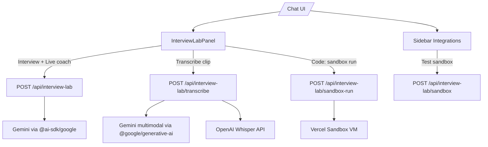

# Interview Lab & App Documentation

This repo is a **Next.js** application that combines:

- **Resume Builder** (build and export a resume)
- **Career Assistant Chat** (multi-model chat with session-only API keys)
- **Cover Letter** workflow
- **Interview Lab** (mock interview rounds, coding tests, and live coaching)

This document is the “one stop” guide for **running the app**, configuring **Integrations**, and understanding **Interview Lab** architecture.

## Quick start

Prereqs:

- Node.js (recommended: current LTS)
- `pnpm`

Run:

```bash
pnpm install
pnpm run dev
```

Open the app and navigate to `/chat`.

## Environment variables

Copy `.env.example` → `.env` and fill values.

### Required for Interview Lab (Gemini)

- **`GOOGLE_GENERATIVE_AI_API_KEY`**: required for Interview Lab’s AI streaming (`/api/interview-lab`).

### Multi-model reference links (docs)

Used to show a **“Learn more”** link when the current model is incompatible with Interview Lab:

- **`NEXT_PUBLIC_MULTI_MODEL_DOCS_URL`**: browser-visible docs URL (recommended)
- **`NEXT_PUBLIC_MULTI_MODEL_API_URL`** / **`MULTI_MODEL_API_URL`**: fallback(s)

Resolution order is implemented in `lib/multi-model-docs.ts`.

### Optional: Whisper transcription fallback

- **`OPENAI_API_KEY`**: used by `/api/interview-lab/transcribe` if Gemini multimodal fails or is not configured.

### Optional: Vercel Sandbox (isolated code execution)

Interview Lab Code tab (and coding challenges) can run code in Vercel Sandbox.

Server env:

- **`VERCEL_PROJECT_ID`**
- **`VERCEL_TEAM_ID`**
- **`VERCEL_OIDC_TOKEN`** (recommended) or `VERCEL_TOKEN` (PAT)

Local workflow:

```bash
vercel link
vercel env pull
```

You can also paste a token in **Sidebar → Integrations → Vercel Sandbox** (session-only).

## Using Interview Lab

Open Interview Lab from the clapper button on `/chat`.

### Tabs

#### Interview

- Streams a “technical interviewer” style conversation.
- Requires:
  - **Gemini model** selected in chat settings
  - A **Gemini API key** in the model menu (session-only) or server env key

If the model is incompatible, the panel shows an **inline banner** with **Switch to Gemini**.

#### Code

- Runs the built-in “Two Sum” harness for:
  - TypeScript/JavaScript (exec path depends on mode)
  - Python (exec path depends on mode)

Execution modes:

- **Vercel Sandbox** (preferred when configured):
  - Endpoint: `POST /api/interview-lab/sandbox-run`
  - Requires Sandbox credentials (see env section).
- **Local VM fallback**:
  - Endpoint: `POST /api/code-run`
  - JS/TS runs in Node VM.
  - Non-JS languages receive structured feedback.

The UI shows a badge with **Vercel Sandbox** vs **Local VM** and timings.

#### Live

- Screen share (client-side)
- Recording into attachments (WebM)
- Speech-to-text using Web Speech API (client-side)
- Optional server-side transcription:
  - Endpoint: `POST /api/interview-lab/transcribe`
  - Accepts WebM (audio/video). Tries **Gemini multimodal** first, then **Whisper** fallback.
  - Supports NDJSON progress events when `Accept: application/x-ndjson`.

The transcript is editable before you send it to the AI coach.

## Sidebar Integrations (API keys)

The sidebar includes **Integrations** accordion:

- **Chat & Interview Lab**
  - Shows compatibility status with the currently selected model
  - One-click “Switch to Gemini”
  - Docs link (from `.env`, optional per-user override)
- **Vercel Sandbox**
  - Copy-to-clipboard commands (`vercel link`, `vercel env pull`, etc.)
  - Session-only token field and a “Test Sandbox connection” button
- **Clip transcription**
  - Optional OpenAI key field (session-only)

Important security behavior:

- API keys/tokens are **not persisted** in localStorage.
- The Gemini key is set in the chat model menu **for the current session only**.
- The Vercel token can be pasted **for the current session only**.

## API endpoints (Interview Lab)

- **`POST /api/interview-lab`**
  - Streams Gemini text for Interview/Live coach.
  - Returns `422` if the selected model is not Gemini.
- **`POST /api/interview-lab/transcribe`**
  - Accepts WebM audio/video. Gemini-first, Whisper fallback.
  - Progress streaming via NDJSON when requested.
- **`POST /api/interview-lab/sandbox`**
  - Simple “connection test” endpoint (echo + stop).
- **`POST /api/interview-lab/sandbox-run`**
  - Runs the “Two Sum” harness in a Sandbox VM and returns combined output.
- **`POST /api/code-run`**
  - Local VM fallback runner (existing route).

## Architecture diagram



## Troubleshooting

### “Interview Lab requires Gemini”

- Switch your chat model to a `gemini-*` model (button in the panel or sidebar).
- If you use a different provider for general chat, keep it there — but **Interview Lab** is Gemini-only.

### “Add your API key…”

- Open the model menu near the chat input → **API key (this session)** → paste Gemini key.
- Or set `GOOGLE_GENERATIVE_AI_API_KEY` in `.env`.

### Vercel Sandbox errors

- Ensure `vercel link` has been run for this repo.
- Ensure `VERCEL_PROJECT_ID` + `VERCEL_TEAM_ID` are present for server routes.
- If using the sidebar token, it is session-only; refresh clears it.

### Transcription failures

- Gemini multimodal requires a valid Gemini key.
- Whisper fallback requires `OPENAI_API_KEY` (or OpenAI key provided from Integrations).
- ffmpeg/ffprobe must be present on the server. (Local dev: Homebrew ffmpeg works.)

## App overview (non-Interview-Lab)

High-level pages:

- **`/`** Resume Builder
- **`/chat`** Career assistant chat + Interview Lab + Integrations
- **`/cover-letter`** Cover letter flow

Data model notes:

- Chat sessions and profile information are stored client-side.
- API keys are session-only and intentionally not exported.

